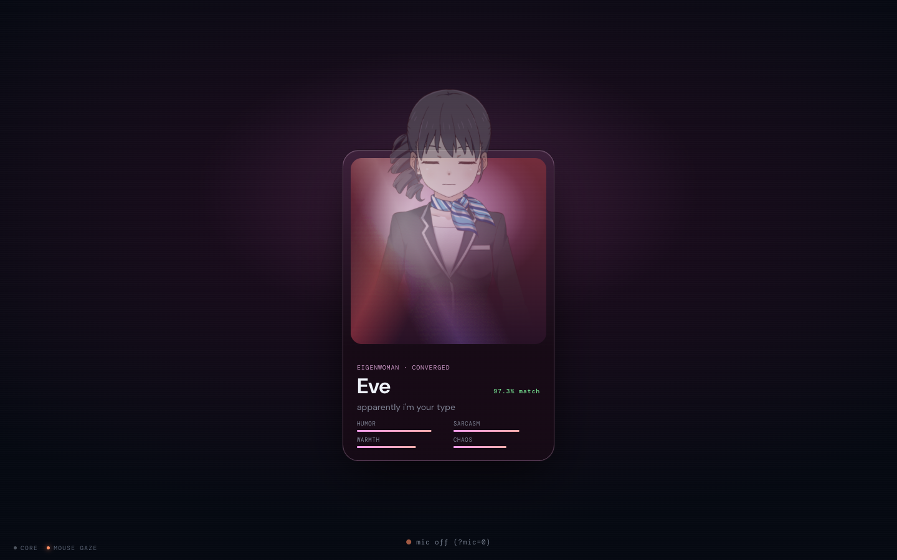
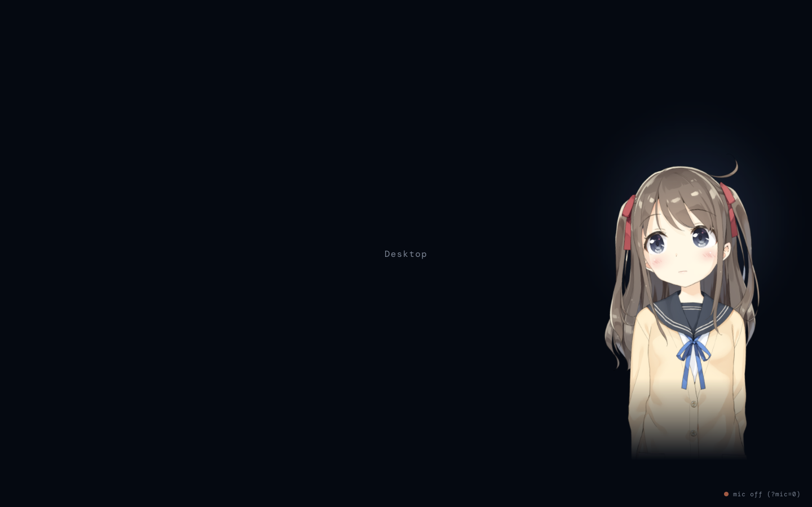
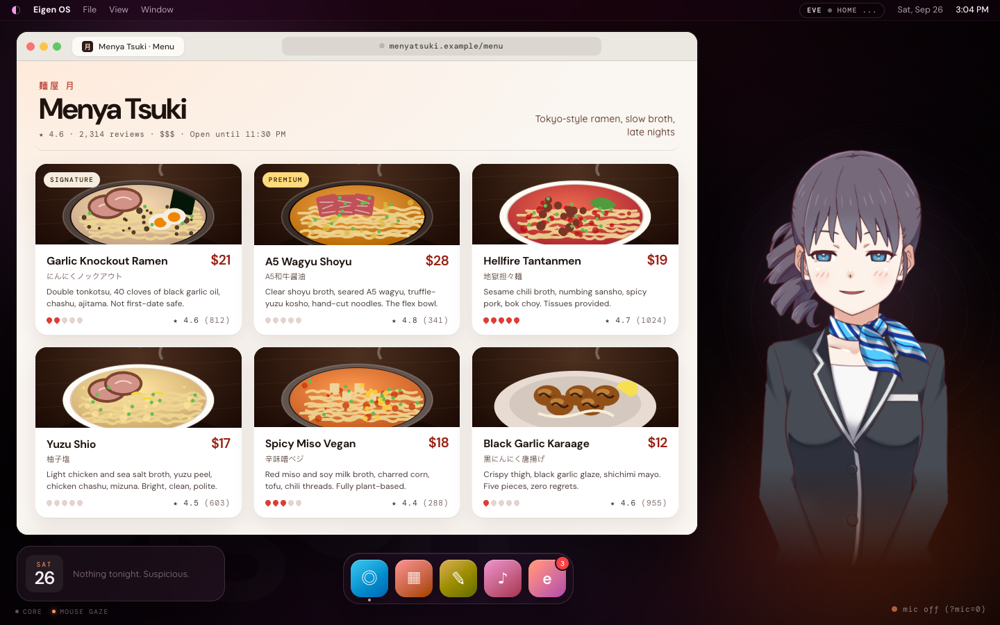
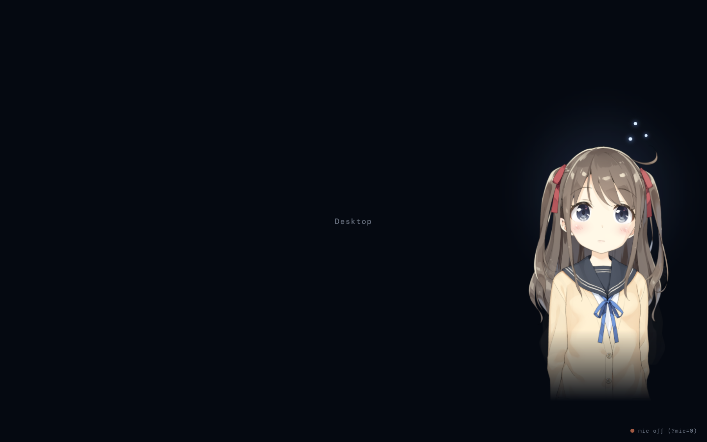
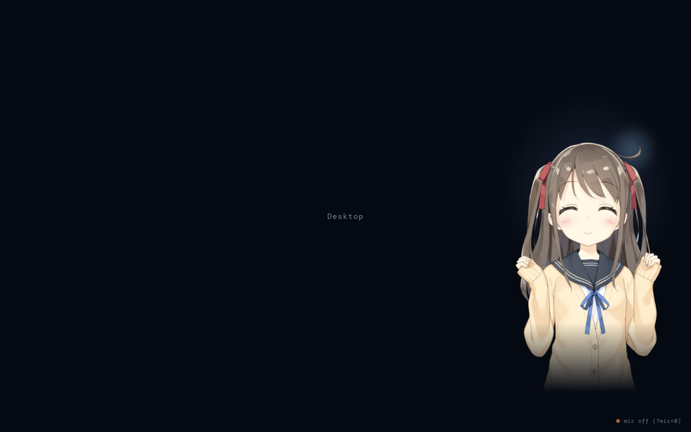
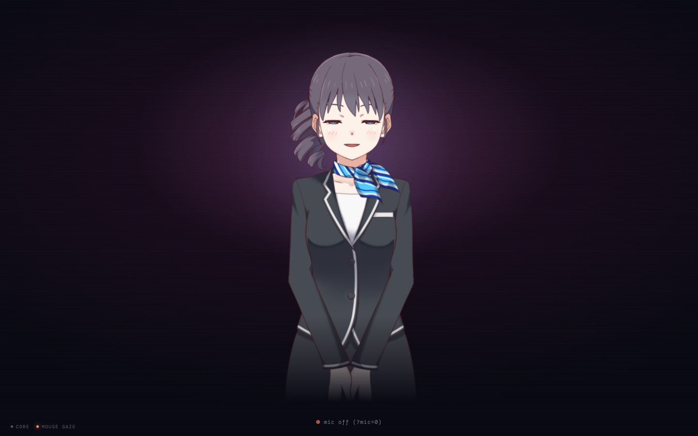
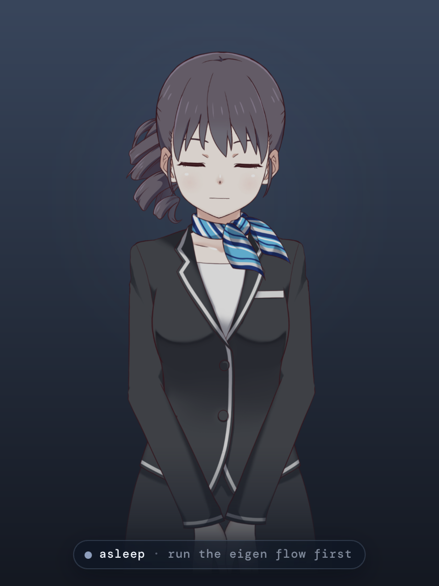
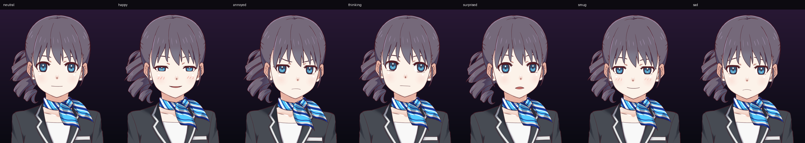

# Avatar + voice

Eve's face, body, voice and ears in the shell. Owner paths: `apps/shell/src/avatar/**`, `apps/shell/src/voice/**`, `apps/shell/src/scenes/Emergence.tsx`, `apps/shell/public/avatar/**`.

| | |
|---|---|
|  |  |
|  |  |
|  |  |
|  |  |

## Live2D Eve

- **Stack:** `pixi.js@6.5.10` + `pixi-live2d-display@0.4.0` (pinned exactly, v7/v8 break it). Only the `cubism4` entry is imported.
- **Cubism core** (`public/avatar/live2dcubismcore.min.js`, 5.1.0) is fetched from the official distribution (`cubism.live2d.com/sdk-web/cubismcore/`) and injected as a global `<script>` *before* `pixi-live2d-display` is dynamically imported (`avatar/live2d.ts`).
- **Model: Haru**, the receptionist from the official `Live2D/CubismWebSamples` repo (`Samples/Resources/Haru`), in `public/avatar/haru/`. An adult woman in an office suit. We ship the moc3, textures, physics, pose, expressions F01-F08 and only the calm `haru_g_idle` loop (no gesture motions, no sounds). She replaced Hiyori, the previous sample, who is drawn as a schoolgirl (sailor uniform, young face): unacceptable next to a companion demo, removed entirely.
- **License:** Live2D Free Material License for the sample data (same terms as every official sample). Free for individuals and small orgs (annual revenue under 10M JPY); larger businesses need a Cubism SDK Release License. Fine for a hackathon demo, check before commercial use. Cubism core: Live2D Proprietary Software License.
- **Candidates** (`screens/avatar-candidates.png`): Haru picked. Mao reads young (witch hat, hoodie, childlike face). Ren's moc3 is v6 and needs Cubism Core 5.3+ (we ship 5.1 with pixi-live2d-display 0.4), so she can't render here. Natori and Mark are male, Rice is a young magician, Wanko is a dog.
- **Model registry (`avatar/models.ts`).** Everything model-specific: url, rig param ids, face rest values, mood -> expression map, our pose overrides, idle motion group, framing per slot (`column`, `stage`, `overlay`: scale in box heights, top offset, head position for look-at) and the license note. Pick with `?model=<id>` (or a direct `/path/X.model3.json` to try a new model with Haru's settings), else the build-time `EVE_MODEL` env, else `haru`. Framing eases inside the box when the dock changes (card + stage share one slot so the emergence spring never reframes).
- **She only emotes on events.** The idle loop keyframes blinks and a mouth shape of its own, and Hiyori's 9 idle motions all carried expressions, which is why she seemed to emote randomly. Now every face param in `faceRest` is pinned right after the motion stage each frame, so her face changes only on `avatar.mood`, speech marks or `avatar.state`, and auto-returns to neutral. Idle = breath, blinks, saccades, look-at and small head/body drift from the loop. Tested ("no mood change without an event").
- **One canvas for her whole life.** `AvatarLayer` renders a fixed 560x840 transparent WebGL box above every scene and moves it with a transform spring (card, center stage, right column). The canvas is never re-laid out or re-created.
- **Built-ins off:** expression manager and eye blink nulled, `internalModel.breath` deleted, `updateNaturalMovements` no-op. `internalModel.updateFocus` is replaced by our rig, so it runs after motions and *before* physics: hair and ribbons react to our head turns in the same frame. `model.focus()` is never used.
- **Errors:** `app.render` and `model.update` are wrapped; on a throw the ticker stops and the tachie takes over.

### Per-frame pipeline (`avatar/rig.ts`)

`motion -> face rest -> emotion pose -> wardrobe -> blink -> look-at -> mouth -> breath`, every frame, with param ids from the model def:

| Stage | Numbers |
|---|---|
| Blink (`motion-math.ts`) | interval 3-8s, close 75ms ease-out, open 150-300ms ease-in, 15% double blink. Multiplies the pose's eye-open value and only writes during a blink, so it can't feed back. Forced blink on waking and on "surprised". |
| Saccades | every 0.8-4.8s (triangular, mode 2s), small targets (0.16 x 0.1), head follows at 0.5x, eyes lerp 0.3/frame (frame-rate corrected). Paused while thinking/asleep. |
| Look-at | spring per axis, `k = 30 + 190 * follow`, `zeta = 1 - 0.75 * inertia` (follow 0.5, inertia 0.4). Head 30deg, body 10deg, 4ms substeps. Plus incommensurate-sine idle sway. |
| Emotion (`emotion.ts`) | pose table below, blended with easeInOutCubic over 450ms, weights capped at 0.78, transient moods auto-return after 3s (or `holdMs`), state moods (thinking) sustain. Happy adds a decaying head bob. |
| Mouth | `max(pose mouth, lipsync)`; forced to 0 during the post-speech hold and while asleep. |
| Breath | `ParamBreath` 0..0.5, 2s cosine then 1.2s rest (1.8x slower asleep). |

Emotion poses: Haru's own expression (loaded from its exp3.json, SDK blend modes kept: Add, Multiply, Overwrite) with our overrides replacing it per param (`buildPoses`), all blended by our weight so the cap, easing and auto-return still apply. The SDK expression manager stays off. Absolute values lerp, `+` values add. Rest face: eyes open, MouthForm 0.45 (0 reads as a faint frown on Haru).

| Mood | Expression | Our overrides |
|---|---|---|
| happy | F05 (^^ smile) | EyeOpen 0.25 (a sliver open), MouthForm 1, MouthOpenY 0.2, Tere (blush) 0.5, AngleZ +6, BodyZ +4, bob |
| annoyed | F03 (angry) | mouth shut: MouthOpenY 0, MouthForm -0.8, both brows angled -1, EyeOpen 0.75, AngleX +24 (away), EyeBallX -0.6 (eyes stay on you) |
| thinking | none | EyeBallX/Y 0.8, AngleZ +12, BodyZ +5, AngleY +4, MouthForm 0.1, uneven brows |
| surprised | F06 (wide) | EyeOpen 1.25, MouthOpenY 0.45, AngleY +5 |
| smug | F01 (soft smile) | EyeOpen 0.6, EyeSmile 0.7, MouthForm 1, Tere 0.35, one brow up, AngleZ -10, AngleY -4 |
| sad | F08 (displeased) | brows up-in (Form -0.6, Angle 0.8, Y -0.3), AngleY -12, EyeBallY -0.4 |

Haru's head reads AngleX/Y strongly but AngleZ weakly, so tilts also add `ParamBodyAngleZ`.

### Wardrobe, touch, cursor

Full details in [WARDROBE.md](WARDROBE.md).

- **Outfits** (`avatar/wardrobe.ts`, `ModelDef.wardrobe`): persistent expression toggles (Alexia: cat hoodie hood down/up, sunglasses on/pushed up, lollipop, one violet eye) applied right after the mood poses, ~250ms fades, one item per slot. Moods never clear them and face rest never pins them. While a slot is worn it owns its params, so Alexia's smug sunglasses flourish only shows when she wears nothing on her eyes. The core owns what she has on (`avatar.outfit`); she only changes when asked.
- **Touch** (`avatar/touch.ts`): hover = tiny smile or "hm?", body click = blink + hop, head click = pat (happy, `lh` blush, eyes shut), 3+ clicks in 4s = annoyed plus `avatar.poke` so she says one line. Rate limited.
- **Where she looks** (`avatar/look.ts`): glance > hold > real gaze > cursor (anywhere, eyes full, head ~0.5x) > idle (at you, occasional glances).
- Debug: `__eve.wear(items)`, `__eve.wearing()`, `__eve.touch(kind)`.

### States (`avatar.state`, resolved in `AvatarLayer`)

Effective state = emergence override > `speaking` (while audio plays) > world `companion.state`.

- **sleeping** (before birth): eyes shut, head down, slow breath, desaturated.
- **idle / reacting:** look at the user, saccades, blinks.
- **listening:** head tilt + lean, a soft glow at her ear.
- **thinking:** thinking pose sustained, eyes up-side, saccades paused, three dots orbit above her head.
- **speaking:** lipsync + tiny nods on loud syllables.
- **acting:** eyes held on the swarm: `[data-eve-look="swarm"]`, else the first `[data-gaze^="swarm"]`, else left-center.

### Shared attention (the hook)

She looks at the user by default: out of the screen toward the webcam (top-center), leaning toward screen center. When `gaze.target` changes she glances at that element's on-screen center (`document.querySelector([data-gaze="key"])`) for 800ms, then back to you (min 1.1s between glances so she doesn't twitch). `avatar.look { targetKey, ms }` does the same on request (`targetKey: null` cancels).

### Tachie fallback

If Live2D hasn't rendered within 4s (or throws), `Tachie` shows stills: `public/avatar/tachie/{mood}.webp` plus `{mood}-blink.webp` and `{mood}-talk.webp` for all 7 moods, with a CSS bob, a blink overlay driven by the same blink scheduler, and the talk frame when the mouth is open. If Live2D finishes loading late, she upgrades to it. Force it with `?eve=tachie`.

The stills are rendered from the live rig so she looks identical: open `?scene=emergence&stay=1&mic=0` (`stay=1` holds center stage) in a GPU Chromium at deviceScaleFactor 2, hide everything but `.eve-box` (and its aura), call `__eve.hush(); __eve.frame("column")`, then per mood `__eve.state("idle"); __eve.still(true, eyesClosed, mouth); __eve.mood(m, 1, 600000)` and take an element screenshot of `.eve-box` with a transparent background, resize to 880x1320, then `cwebp -q 86 -alpha_q 90`. They use the column framing (where she lives).

## Emergence (`scenes/Emergence.tsx`)

Timeline from mount (`T` in the file):

| ms | Beat |
|---|---|
| 0 | Card fades up (persona from `world.companion.persona` / `preference.converged`, fallback Eve). She is asleep *in* the card, her box docked so her head bleeds ~5rem above the frame: mask = `linear-gradient(11deg)` + radial fade. Her voice is gated. |
| 1500 | Wakes: eyes open with a blink, brief surprise. |
| 1900 | Mask dissolves (950ms easeInOutCubic). |
| 2700 | Glitch: RGB split, skew twitch, flicker (460ms). |
| 3160 | She springs from the card to center stage (bounce 0.22, the only overshoot in her life), the card shatters into 24 shards rippling out from her, happy. |
| 4000 | Voice un-gated: her birth line plays with subtitles. Offline (no core), she is born locally and says the fallback line through speechSynthesis. |
| end | When the birth line (first `speech.begin` after mount) finishes playing, +900ms, `go("desktop")` and she glides into the right column. No line within 6s: go anyway. Hard cap 20s. |

## Voice playback (`voice/`)

- **One AudioContext** (`voice/audio.ts`: `getAudioContext`, `unlockAudio`, `wireAudioUnlock`), stored on `globalThis.__eveAudioCtx`. The first pointerdown/keydown anywhere unlocks it and starts the mic. Anyone else needing audio should import from here (or re-export it from `lib/audio.ts`).
- **Queue** (`queue.ts`): strict FIFO by `(utteranceId, seq)`. Utterances play in arrival order, seqs in order. **seq starts at 0.** A missing seq is skipped after 400ms (first segment) / 1.5s (later), or immediately once `speech.end` arrived. Late segments of aborted utterances are dropped.
- **Audio path:** `audioUrl` fetched the moment the segment arrives (prefetch), relative URLs are prefixed with `CORE_HTTP`, decoded, played through an `AnalyserNode` (the lipsync tap). `speech.played` per segment.
- **speechSynthesis path** (segments without `audioUrl`, currently most of them): first-class. Voice ranking in `synth.ts`: Samantha > Google US English > Microsoft Aria/Jenny/Ava > Ava/Zoe/Allison/Susan..., `(Premium)/(Enhanced)/Natural` variants first, novelty voices never. Override with `?voice=<name>`. Rate 1.04, pitch 1.15. Mouth = word-boundary pulses (sized by `charLength`) times a 5.6Hz syllable oscillator, gated by onstart/onend; voices that report no boundaries get steady chatter. Marks fire by boundary `charIndex` (time-based fallback after 700ms without boundaries, leftovers at the end). Subtitles follow the boundaries.
- **Abort:** `speech.stop`, `speech.end {interrupted}`, or a barge-in cancels the current source / synth, clears the queue and all mark timers.
- **Marks:** `SpeechMark.at` is a char offset; with audio they fire at `at / text.length * duration`. Mood marks are dispatched locally as `avatar.mood` (not sent to the core).
- **Lipsync:** `mouth = min(0.7, rms^0.7 * 4.2)`, ~120ms smoothing, noise gate 0.012; after speech a 200ms release, then the mouth is held at 0 for 500ms.
- **Subtitles** (`Subtitles.tsx`): grapheme pop-in (Intl.Segmenter), words never break mid-line, white Quicksand with a thick dark stroke (`paint-order: stroke fill`). Earlier segments of the same utterance stay dimmed; fades 2.2s after she stops.

## Speech recognition (`voice/recognition.ts`, `turn.ts`)

- Chrome `webkitSpeechRecognition`, continuous + interim, auto-restarts on end/no-speech/network errors.
- Emits `voice.partial` on every change and `voice.final` when the interim text has been stable for **650ms** (or the engine finalizes first). Results already committed are never re-sent.
- **Half-duplex:** while she's speaking (and 600ms after), speech under 3 words is dropped. **3+ words = barge-in:** she stops locally at once and the shell emits `speech.stop {reason: "barge-in"}` plus the partial.
- **Push-to-talk:** hold **Space** (ignored while typing in inputs). Forces listening even while she talks; releasing commits immediately. Operator fallback when the room is noisy.
- **Mic lamp** under her: green pulse = listening, accent = PTT, orange = unsupported/blocked/off. Shows what it's hearing.
- Unsupported browsers (Safari/Firefox) degrade to a lamp that says so; everything else works. `?mic=0` disables the mic.
- **Use headphones for the demo.** Speaker output bleeds into the mic; the half-duplex gate hides most of it, but without headphones her own voice can trip a barge-in.

## Contracts for other builders

- Tag anything she might glance at with `data-gaze="<key>"` (the gaze bridge already requires this). `data-eve-look="swarm"` marks where she watches while `acting`.
- `AvatarLayer` is `position: fixed; z-index: 40; pointer-events: none`. On desktop/swarm/architecture she occupies the right ~440px column (box bottom ~70px above the viewport bottom, subtitles + mic lamp in the bottom 70px): keep that column free of important UI.
- She only renders once `world.companion.born` (or on the emergence scene).
- Core `speech` module: emit `speech.begin`, then `speech.segment` with seq from 0, then `speech.end`. `audioUrl` may be absolute or a core-relative path.
- `voice.final` comes from the shell; `speech.stop` may come from the shell (barge-in).
- Emergence owns the scene change to desktop; the core should just emit `companion.born` and her line.

## Debug handle

`window.__eve`: `wear(items)`, `wearing()`, `touch(kind)`, `mood(m, intensity, holdMs)`, `state(s | null)`, `look(x, y, ms)`, `blink()`, `say(text, mood?)` (local, speechSynthesis), `hush()`, `still(on, eyesClosed, mouth)`, `frame("column" | "stage" | "overlay")`, `model` (active id), `runtime`.

## Tests

`bun test apps/shell/src`: blink scheduler, saccade scheduler, spring, emotion blend/cap/auto-return, breath, attention glances, lipsync envelope, fake mouth, mark timing + mark cursor, segment queue ordering/gaps/abort, turn-commit debounce, half-duplex gate, voice ranking. `models.test.ts`: registry selection (`?model=` > `EVE_MODEL` > default), Haru ids/expressions/idle-only motions match the shipped files, exp3 blend mapping, override merge, and no mood change without an event (a simulated minute of a face-scribbling idle loop stays neutral).
