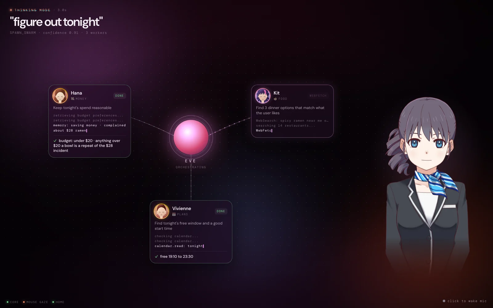
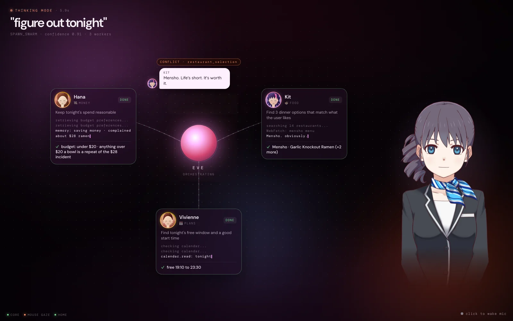
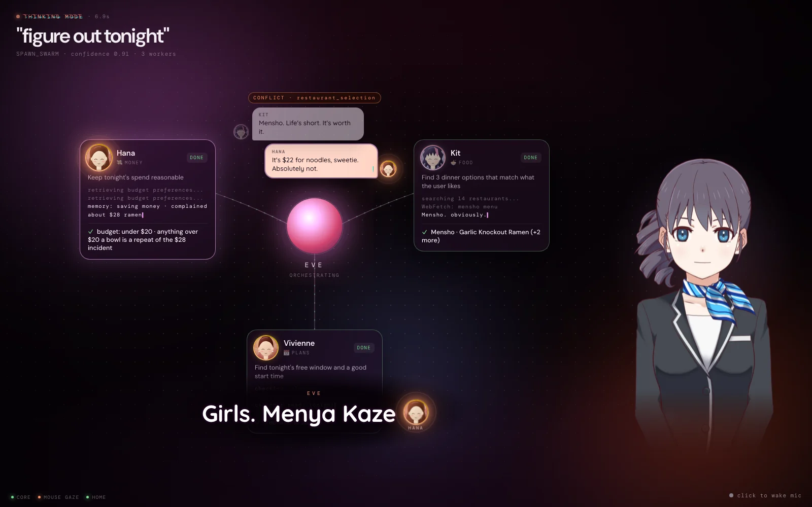
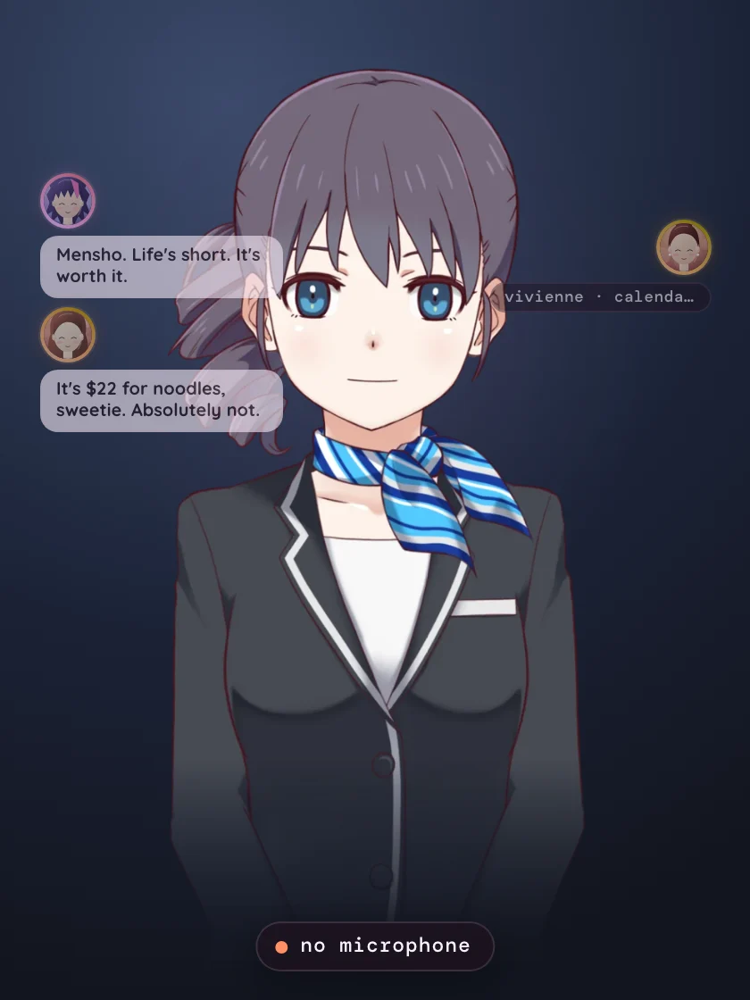
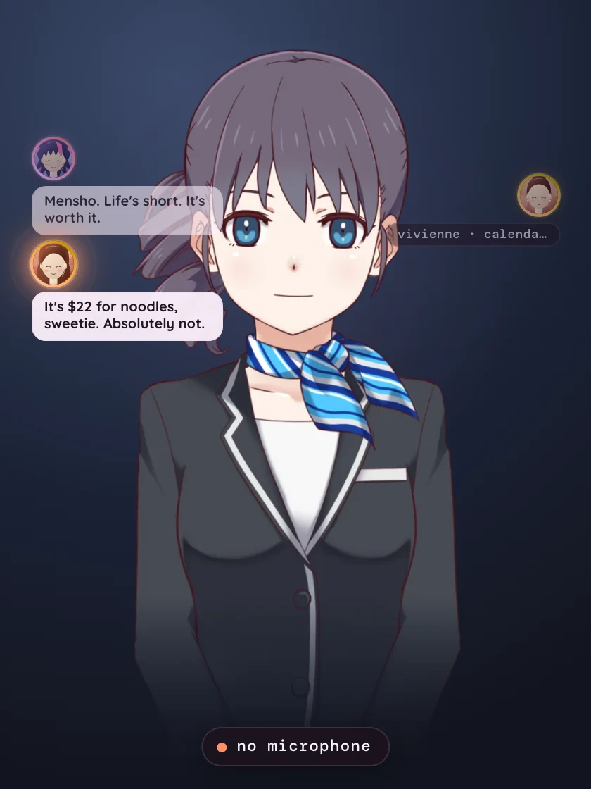

# Harem

Eve is permanent. Her wives are ephemeral sub-agents (`packages/harem`, see its README for the planner, schemas and caps). This page is about who they are and how they show up on screen.

## The wives are the girls he swiped past

Every wife is one of the 12 Eigen profiles from Act I (`packages/protocol/src/candidates.ts`). The archetypes (food, calendar, budget, logistics, research) are the job; the candidate is who shows up to do it. The callback lands on its own: the girls he looked past in the dating app are now arguing about his dinner.



### Casting (`packages/harem/src/identity.ts`)

- **Role fit.** `ROLE_FIT` weights her hidden trait vector per role, normalized to about -1..1:

  | role | leans on | against | usually |
  |---|---|---|---|
  | calendar (PLANS) | career_focus, nerdiness, polished, ambition | chaos, spontaneity | Vivienne |
  | budget (MONEY) | warmth, polished | chaos, spontaneity, nightlife, travel | Hana |
  | food | nightlife, spontaneity, travel, humor, chaos | | Kit |
  | logistics (PLACES) | outdoors, travel, fitness, sporty | chaos | Sol |
  | research | nerdiness, career_focus, warmth | chaos | Ada or Wren |

- **Deterministic.** Score = fit + a small per `(taskId, role, candidate)` hash jitter (`JITTER = 0.1`). Same task, same cast. Across tasks the best fit wins most of the time; near-ties (research: Ada 0.74 vs Wren 0.67) rotate.
- **No repeats in a task.** `assignCandidates(taskId, roles)` is greedy over every (role, girl) pair, best score first, so two roles that want the same girl settle it by fit, not plan order. `HaremManager.spawn(taskId, spec, who?)` takes that identity; called bare it picks by fit and skips girls already on the task.
- **Voice, not numbers.** Her system prompt is the archetype's, re-voiced ("You are Hana, Eve's budget wife") plus a persona block with her age, job, city, tagline and her three prompt answers. It explicitly never changes numbers, facts or lane.

### Events (additive)

| event | new field |
|---|---|
| `swarm.spawn` | `candidateId` (her candidates.ts id). `name` is now her name, `label` is `"💸 HANA · budget wife"`, `emoji` stays the role glyph. |
| `swarm.resolve` | `winner`: the agentId whose side Eve took (the food wife if her top pick survived or Eve had to relax that constraint, else the other side). |

### Quips

Conflicts are still found by comparing structured results (zero extra model calls), but each side's one line comes from `QUIPS[candidateId]`, written from her profile. The old generic lines are the fallback for anyone without a candidate. The golden demo cast:

```
SPAWN 🍜 KIT · food wife (kit)
SPAWN 📅 VIVIENNE · calendar wife (vivienne)
SPAWN 💸 HANA · budget wife (hana)
CONFLICT 🍜 Kit  "Mensho. Life's short. It's worth it."
CONFLICT 💸 Hana "It's $22 for noodles, sweetie. Absolutely not."
EVE "Girls. Menya Kaze." -> 💸 Hana
```

## Swarm scene (`apps/shell/src/scenes/Swarm.tsx`)

- Each wife node shows her face (`components/WifeFace.tsx`): the same art as her dating card (the generated `/candidates/<id>-1.webp` when it exists, else the procedural `PortraitArt` framed with `HEAD_VIEWBOX`), a circular crop with a conic ring in her card hue (`PERSON_ART[id].hue`). Under her name: role glyph + `FOOD` / `PLANS` / `MONEY` / `PLACES` / `RESEARCH`.
- Conflict bubbles carry her face and name next to the quip.
- Eve's call: when `swarm.resolve.winner` lands, the winner's card and face glow (pulsing ring), the loser dims, and her face pops in next to Eve's stroked "Girls. Menya Kaze." line. The glow holds until `task.done`.
- The radial fan-out, ripple stagger, lines, merge and approval card are unchanged.




## Desktop overlay (`apps/shell/src/overlay/WifeBubbles.tsx`)

When a task runs and no shell switched to its swarm scene for it, the active wives float beside Eve in the overlay window: small portrait bubbles alternating left and right of her head, never over her face, with one tiny caption each (`kit · searching 14...`). Quips replace the caption for ~3s in a brighter two-line bubble, the winner glows, and everyone fades back into her ~1.8s after the merge.

- Pure state in `lib/wives.ts`: `reduceWives` (swarm.* + `shell.scene`), `visibleWives`, `sideSlots`, `shellShowing`. A shell counts as showing the swarm only if it flipped to `swarm` within 5s of this task starting, so a stale scene from a tab closed mid-run doesn't hide the bubbles.
- Click-through is untouched: the bubbles are `pointer-events: none` and the overlay's hit test only ever reads Eve's pixels.




## Try it

```bash
EIGEN_PORT=7791 bun run --cwd packages/core start                  # a core on a spare port
(cd apps/shell && bunx vite --port 5191 --strictPort)               # a shell on a spare port
open "http://127.0.0.1:5191/?core=127.0.0.1:7791&scene=desktop&gaze=mouse"
bun run packages/harem/src/cli.ts "figure out tonight" --bus --approve --core=127.0.0.1:7791
```

`--core=host:port` (or `EVE_CORE`) points the CLI at a non-default core. For the overlay look, open `?mode=overlay&core=127.0.0.1:7791` in a tab instead of the shell.
