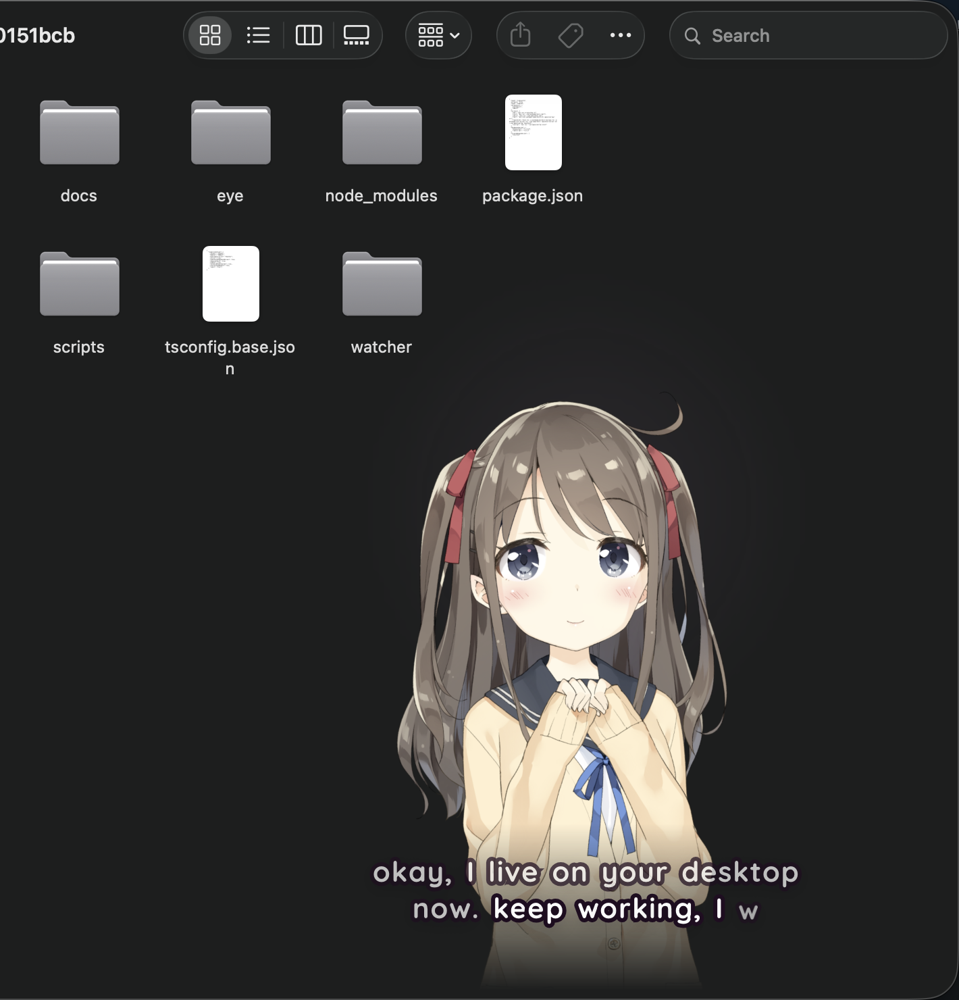

# Overlay: Eve on your real desktop

Eve steps out of the browser and lives on top of your normal apps while you work. She's a transparent, frameless, always-on-top panel in the corner of your screen. Her pixels take the mouse (drag her anywhere). Everything around her clicks straight through to whatever's underneath. She hears you through the mic via Deepgram, talks back with the same voice, lipsync and subtitles as the shell, and never steals focus from the app you're typing in.



## Run it

```bash
bun install
bun run dev        # core :7777 + shell :5173 (leave it running)
bun run overlay    # in a second terminal: Eve appears bottom-right
```

She has to be born first (the Eigen flow in the shell: `open http://127.0.0.1:5173`). Until then the overlay shows a small sleeping Eve with "asleep · run the Eigen flow first". Once she's born, `~/.eve/profile.json` restores her on every core restart.

`bun run overlay` builds `apps/overlay` (Electron 44) and loads `http://127.0.0.1:5173/?mode=overlay`. If the shell isn't up yet it retries every 2s. If the core is down she dims, falls asleep, and the chip says **core offline**. The bus and the mic stream both reconnect by themselves when it comes back.

| Env | Default | What |
|---|---|---|
| `EVE_OVERLAY_URL` | `http://127.0.0.1:5173/?mode=overlay` | full page URL override |
| `EVE_SHELL_URL` | `http://127.0.0.1:5173` | where the shell is |
| `EVE_CORE` / `EIGEN_PORT` | `127.0.0.1:7777` | where the core is (passed to the page as `?core=`) |
| `EVE_OVERLAY_CAPTURABLE=1` | off | let screenshots / screen shares see her this run (for recording a demo) |
| `DEEPGRAM_API_KEY` | from env, `.env`, or jabby's `.env` | speech-to-text (core side) |
| `EVE_STT_MODEL` | `nova-3` | Deepgram model |

`?mode=overlay` also renders in a normal browser tab (handy for design work), minus click-through and the tray.

## Using her

- **Talk.** She's listening whenever the chip says `listening`. What she hears shows up in the chip as you speak. Same half-duplex rule as the browser shell: while she's talking, only 3+ words get through, and they cut her off (barge-in).
- **Approvals.** When she wants to do something real (a calendar event), the chip says **say "yeah"** with what it is. Say "yeah" / "do it", or "nah".
- **Drag** her by her body or hair to move her (she startles, then settles when you let go). A tap on her head is a head pat (happy, blush, eyes shut); a tap on her body is a poke (blink, small hop). Three or more taps in ~4s and she gets annoyed and says so, at most once per 30s. See `docs/WARDROBE.md`.
- **Flashes** at the top: `remembered · 3ms · ...` when she pulls a memory, `noted · ...` when she saves one, `comment · dating relapse` when she noticed something on her own. They're gone in ~3s.
- **Cursor.** She follows your mouse anywhere on the screen: main polls `screen.getCursorScreenPoint()` at ~30Hz while she's visible and sends it over IPC (`eveOverlay.onCursor`). Eyes follow fully, her head at ~half. When the cursor rests for 4s she drifts back to looking at you (camera, top-center), with an occasional glance around. A real gaze point (`gaze.point`, screen coords) outranks the cursor. Details: `docs/WARDROBE.md`, `apps/shell/src/avatar/look.ts`.
- **Outfit.** Tray > Outfit lists what she can wear as checkboxes (it mirrors the core, so spoken changes show up there too).

### Hotkeys (global)

| Keys | Action |
|---|---|
| `⌘⇧E` | show / hide Eve |
| `⌘⇧M` | mute / unmute the mic |
| `Space` (while she has focus) | push-to-talk: bypasses the half-duplex gate, release to send |

### Menu bar

The heart in the menu bar: show/hide, mute mic, **pause attention** (emits `attention.pause { paused }` on the bus: ambient remarks stop, talking to her still works), move to a corner, size (small / medium / large, anchored at her feet), hide from screen capture, open at login, reload, quit.

Position, size and toggles persist in `~/.eve/overlay.json`. If the monitor she was on is gone, she comes back to the primary display's bottom-right.

## How it works

```
 apps/overlay (Electron main)               apps/shell ?mode=overlay (renderer)          core :7777
 ──────────────────────────                 ────────────────────────────────            ──────────
 BrowserWindow: transparent, frameless,      OverlayApp: Live2D Eve (tachie fallback),    ws /bus  world, speech.*, memory.*, ...
   panel, alwaysOnTop "screen-saver",          subtitles, status chip, flashes
   all workspaces + fullscreen spaces,       hit test: alpha of her pixels under the
   showInactive, skipTaskbar,                  forwarded cursor -> setInteractive(bool) ──► setIgnoreMouseEvents
   contentProtection                         EarsClient: getUserMedia (echo cancel)
 setIgnoreMouseEvents(true, {forward})         -> AudioWorklet -> 16k linear16 ──────────► ws /ears ──► Deepgram nova-3
 drag: follows the real cursor at 120Hz     speech.segment playback + lipsync ◄───────── speech.*      │
 tray, ⌘⇧E / ⌘⇧M, mic permission            ◄── mute / attention over IPC                voice.partial / voice.final ◄┘
 POST /emit attention.pause ─────────────────────────────────────────────────────────────►
```

### Click-through

The window ignores the mouse by default but forwards mouse moves to the page. On each move (one per frame) the page reads the alpha of Eve's actual painted pixels under the pointer: `gl.readPixels` on the Live2D canvas (the page claims the WebGL context with `preserveDrawingBuffer: true` before Pixi does), or the visible tachie still drawn into a 2D canvas. It samples a 5-point neighborhood so hair tips are grabbable, and multiplies by the same bottom fade that masks her. `ClickThroughGate` turns that into a steady flag: interactive the moment alpha crosses 48, click-through again only after it stays under 16 for 140ms, never mid-drag, and immediately when the pointer leaves the window. Only then does the page call `setInteractive(on)`; the main process flips `setIgnoreMouseEvents`. All of that is pure and tested (`apps/shell/src/overlay/hittest.ts`).

Dragging: the page sends `dragStart` after 4px of movement; main records the cursor offset and moves the window with `screen.getCursorScreenPoint()` until `dragEnd`, then clamps her onto a display and saves.

### Ears (Deepgram)

Electron has no Web Speech backend, so the overlay always streams audio to the core. The shell picks its STT source with `?stt=`:

| `?stt=` | Source |
|---|---|
| `browser` (default in a tab) | Chrome Web Speech, as before |
| `deepgram` | mic -> core `ws /ears` -> Deepgram |
| `auto` | `deepgram` when `GET /api/ears/status` says available, else `browser` |
| (overlay) | always `deepgram` |

Core module `packages/core/src/ears`:

- `ws /ears?encoding=linear16&sample_rate=16000&client=overlay` (or `encoding=webm` for containerized opus). Binary frames are audio. Text frames are JSON control: `{type:"eve", speaking}` (the client plays her audio, so it reports exactly when she's talking), `{type:"ptt", down}`, `{type:"finalize"}`. The server sends back `status | partial | final | bargein | dropped` so the client can draw what it heard.
- Proxies to `wss://api.deepgram.com/v1/listen` with `model=nova-3, interim_results, endpointing=300, utterance_end_ms=1000, smart_format, vad_events` and the key in an `Authorization: Token` header (never in a URL).
- Interim results become `voice.partial`. `is_final` chunks accumulate and commit as one `voice.final` on `speech_final` or `UtteranceEnd`. Source `ears`.
- Half-duplex: the same rule as `apps/shell/src/voice/turn.ts`. While she speaks (client report, falling back to `speech.begin/end` on the bus) or within 600ms after, fewer than 3 words are dropped and 3+ words are a barge-in (`speech.stop { reason: "barge-in" }`). An utterance that started over her voice keeps the strict rule until it closes, so her own echo never becomes a turn.
- Reconnects to Deepgram with backoff (250ms to 5s) while the client stays connected, holding up to 1s of audio. `KeepAlive` every 4s of silence. `CloseStream` when the client leaves.
- `GET /api/ears/status` -> `{ available, provider, model, reason?, sessions }`. Without a key: `available: false` and the websocket upgrade is refused with 503.

The hub gained one additive hook for this: `ctx.socket(path, handler)` registers a websocket on an exact path next to `/bus`.

Check it end to end against a running core (decodes an mp3 with ffmpeg and streams it at real time):

```bash
bun run packages/core/src/ears/smoke.ts                       # ~/.eve/voice-samples/luna.mp3
bun run packages/core/src/ears/smoke.ts some.wav --core 127.0.0.1:7777
```

### Voice out

Unchanged: core `speech` -> `speech.segment` -> shell playback with lipsync, marks and subtitles. The window runs with `autoplayPolicy: "no-user-gesture-required"` and unlocks the audio context on load, so she can speak without a click.

## Permissions

- **Microphone.** On first launch macOS asks whether **Electron** may use the microphone (in a packaged build it would say Eve). The overlay calls `systemPreferences.askForMediaAccess("microphone")` at startup. If you said no: System Settings > Privacy & Security > Microphone > enable Electron, then relaunch. Inside the app, `setPermissionRequestHandler` grants `media` to the shell's origin only; everything else is denied.
- **No other permissions.** No accessibility, no screen recording, no input monitoring. Global hotkeys use Electron's `globalShortcut`.

## Privacy

- She is hidden from screenshots and screen sharing by default (`setContentProtection(true)`), so she doesn't leak into Zoom or a recording. Turn it off in the tray ("Hide from screen capture") or for one run with `EVE_OVERLAY_CAPTURABLE=1`.
- Audio goes mic -> local core -> Deepgram, and nowhere else. Nothing is recorded to disk. Only transcripts land on the bus (and in `/events` history). `⌘⇧M` mutes at the track level: no frames leave the machine while muted.
- The page can't navigate away or open windows, runs sandboxed with context isolation, and only gets `window.eveOverlay` from the preload.
- "Pause attention" puts `attention.pause { paused: true }` on the bus for the attention and reflex side to honor (no ambient watching or unprompted remarks). It does not stop the mic; use mute for that.

## Auto-launch

Off by default. "Open at login" in the tray registers a login item that relaunches this Electron with this app path. It still needs the core and shell running (`bun run dev`), so it's mostly useful once you run those as a LaunchAgent too.

## Troubleshooting

| Symptom | Fix |
|---|---|
| Nothing appears | Is the shell up? `curl -I http://127.0.0.1:5173`. The overlay log says "shell not reachable ... retrying". Also try `⌘⇧E` (maybe hidden) and the tray "Move to corner". |
| Chip says `core offline` | `bun run dev` (or `bun run core`). She reconnects by herself. |
| Chip says `asleep · run the Eigen flow first` | Do Act I once in the shell. Or `POST :7777/api/preference/converge` after a few `dating.leave` events. |
| Chip says `ears offline` / never `listening` | `curl :7777/api/ears/status`. `available: false` means no `DEEPGRAM_API_KEY`. `mic blocked` means the macOS mic permission (above). |
| She can't be clicked / clicks don't go through | The log prints `click-through OFF (cursor on eve)` / `ON` on every flip. If Live2D failed she's on the tachie fallback, which hit-tests the same way. `?eve=tachie` forces it. |
| She hears herself | Use headphones, or keep the volume moderate: echo cancellation plus the half-duplex gate handle normal speakers. |
| Hotkey does nothing | Another app owns it; the log says `hotkey ... is taken`. Use the tray. |
| Dock icon / app switcher | There isn't one on purpose. Quit from the menu bar heart. |

Logs: the terminal running `bun run overlay` (`[overlay ...]` lines, plus page warnings and errors).

## Files

```
apps/overlay/src/main.ts        window, click-through IPC, drag, tray, hotkeys, permissions
apps/overlay/src/preload.ts     window.eveOverlay (the only bridge)
apps/overlay/src/state.ts       placement + ~/.eve/overlay.json (pure, tested)
apps/overlay/src/icon.ts        menu bar heart, drawn in code
apps/shell/src/overlay/         OverlayApp, hit test, status chip, bridge types, css
apps/shell/src/voice/{stt,ears,pcm}.ts   STT source switch, Deepgram client, worklet resampler
packages/core/src/ears/         ws /ears, Deepgram proxy, transcript assembler, half-duplex gate
```

## Tests

`bun test packages apps/shell/src apps/overlay/src` covers the ears proxy against a fake Deepgram websocket (interim -> `voice.partial`, `is_final` + `speech_final` / `UtteranceEnd` -> one `voice.final`, reconnect with held audio, keepalive, missing key -> unavailable + 503, half-duplex and barge-in over the real hub), the hit test and click-through gate, the status chip, window placement and persistence, the STT source choice, and the PCM resampler (including evaluating the worklet source in isolation).
