# Shell

The browser half of Eve (`apps/shell`, Vite + React 19 + Motion). Scenes, the Eigen dating app, the restaurant page, the HUD, her swarm workspace, and the closing slide. The avatar and voice layers (`src/avatar`, `src/voice`, `scenes/Emergence.tsx`) are owned separately and render on top.

```bash
bun run --cwd packages/core start          # the bus (optional: everything has a local fallback)
bun run --cwd apps/shell dev               # http://127.0.0.1:5173
open "http://127.0.0.1:5173/?gaze=mouse"   # mouse stands in for the eyes
```

URL params: `gaze=mouse|eye|auto`, `scene=<scene>` (deep link), `core=host:port`, `reticle=0`.

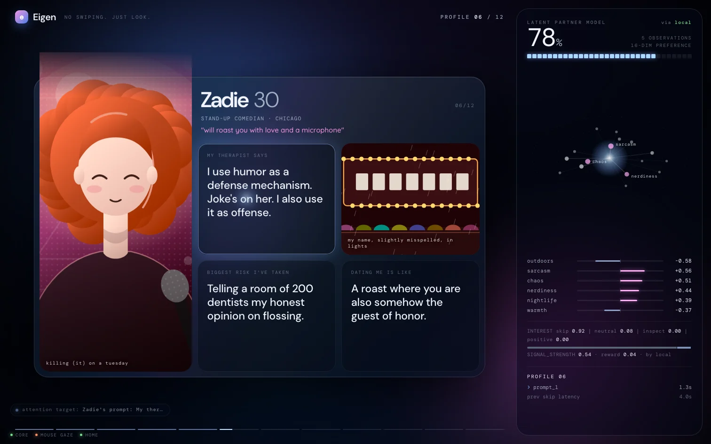

## Flow

| # | Scene | What happens | Leaves when |
|---|---|---|---|
| 1 | `boot` | Self-typing boot log with live core / eye status, glitch title, one **begin** button. The only click in the demo: it calls `unlockAudio()` and emits `shell.ready`. | begin (shutter) |
| 2 | `calibration` | Eye mode: framing, then `useGaze().calibrate()` draws its own dots, then accuracy. Mouse mode: a 3s "attention link established" beat. | automatically |
| 3 | `dating` | Eigen. 12 profiles, auto-advance, holo tilt toward the gaze point, the LATENT PARTNER MODEL panel. | `preference.converged`, progress >= 0.98, or after the last card |
| 4 | `convergence` | `LATENT MODEL 94% ... 99%`, `CONVERGENCE DETECTED`, `EIGENWOMAN FOUND`, `--hue` drifts to `persona.palette.hue`, RGB split, slices, shake, shutter. | `go("emergence")` after ~6s |
| 5 | `emergence` | Avatar builder's scene. | it calls `go("desktop")` |
| 6 | `desktop` | Eigen OS: menubar with Eve's home chip, the Menya Tsuki menu in a browser window, calendar widget, dock, result notifications. Right ~420px stays empty for Eve. | `task.start` / `swarm.plan` / `swarm.spawn` |
| 7 | `swarm` | Her workspace zooms in: Eve's orb, wives fan out with a radial ripple, lines parent to child, streaming progress, conflict bubbles, Eve's pick in big stroked type, facts flowing into her as memory, the approval card. | 3.2s after `task.done`, back to desktop |
| 8 | `architecture` | "HOW DO YOU BUILD A PERSON?" with the body map and live counters, then `EIGENWIFE / Your type, compiled.` | ArrowRight (or 16s) for the final card |

## Operator keys

Press `?` in the shell for this sheet. Every handled key is emitted as `shell.key { key }` and handled off the bus, so a remote operator can `POST /emit` the same thing.

| Key | Action |
|---|---|
| `1` to `8` | jump to boot, calibration, dating, convergence, emergence, desktop, swarm, architecture |
| `→` / `←` | next / previous: next profile in dating, final card in architecture |
| `↑` or `d` | dating relapse: go to the desktop, open the Eigen app window, emit `app.opened { app: "Eigen" }` |
| `↓` | close the Eigen app (also `shell.key { key: "eigen.close" }`) |
| `a` | architecture slide |
| `h` | HUD verbosity: full, quiet (attention target + connection dots), off |
| `g` | gaze reticle on / off |
| `m` | toggle mouse gaze (reloads in place, keeps the scene) |
| `?` / `esc` | key sheet / close sheet and Eigen app |

Keys with cmd / ctrl / alt are left to the browser. Gaze never triggers anything: no blink clicks, no dwell clicks, the dock icon cannot be opened by looking at it.

## Act I details

- **Candidates** live in `packages/protocol/src/candidates.ts`: 12 fictional, clearly synthetic people (`mira sol vivienne kit hana zadie ines wren dahlia priya yuki ada`), each pushing different traits hard so attention separates them. Every one has 2 photos, 3 prompts, a 16-dim trait vector, and 6 regions (`photo1 photo2 prompt1 prompt2 prompt3 meta`) with their own trait emphasis.
- **Gaze keys**: every region is tagged `gazeProps(regionKey(id, region), label, kind, { candidate, region, name })`, so keys are `cand_<id>_<region>`.
- **Auto-advance** (`lib/advance.ts`): look away from the card for 1.5s, or the 7s budget, or `→`. Nothing advances before 1.8s. The thin bars under the card show the budget.
- **On leave** the shell emits `dating.leave { candidateId, regions: useGaze().stats("cand_<id>_"), totalMs, skipLatencyMs }` and resets that prefix. Region keys in `regions` are the full `cand_<id>_<region>` keys.
- **Local fallback** (`lib/fallback.ts`): if the core's preference module stays quiet for 900ms after a leave, the shell dispatches its own `dating.signal` and `preference.update` locally (`source: "shell"`, not sent to the hub) using the same math, `P = Σ(r_i · E_i) / Σ r_i`, where `E_i` is the candidate vector nudged toward the regions that were looked at. Progress is `1 - 0.64^n` (0.98 at profile 9). On convergence it emits `preference.converged` over the wire with a locally synthesized persona, so the avatar always gets one. Once any core `preference.update` arrives, the fallback stands down for the session.
- **Panel readouts**: trait rows are lifts versus the candidate pool (`humor +0.82`), the constellation pulls nodes toward the center as progress rises, the interest line is the latest `dating.signal`, and the attention readout lists live region dwell with revisits.

## Art

The OpenAI key had no credits at build time, so every image renders as procedural art (`components/GenArt.tsx`): character-select portraits with per-candidate hair, accessories and skin tones, a scene per candidate for photo 2, and illustrated ramen for the menu. `ArtImage` tries the real file first and falls back on 404, so generating images later needs no code change:

```bash
OPENAI_API_KEY=... bun apps/shell/src/data/gen-art.ts            # all portraits, scenes, menu
OPENAI_API_KEY=... bun apps/shell/src/data/gen-art.ts --only kit --force
```

It writes `public/candidates/<id>-1.webp`, `<id>-2.webp` and `public/menu/<dish>.webp` (stylized anime illustration, 1024x1536, `cwebp` resized).

## Contracts other modules rely on

| What | Contract |
|---|---|
| Audio | `lib/audio.ts` exports `unlockAudio()`, `getAudioContext()`, `isAudioUnlocked()`. It shares the single context on `globalThis.__eveAudioCtx` with `voice/audio.ts`. |
| Region keys | `cand_<id>_<region>` via `regionKey()`. Ids are stable. |
| Menu targets | keys `menu_<dish id>`, kind `menu-item`, meta `{ name, price, spice, rating, reviews, restaurant, tags }`. Header `restaurant_header`. On desktop mount the shell emits `page.context { url, title, targets, markdown }` and `app.focused { app: "Browser" }`. |
| Other gaze targets | `dock_<app>`, `app_eigen`, `calendar_widget`, `home-status`, `task_result`, `swarm_eve`, `swarm_<agentId>`. |
| Eigen app | Opens on `app.opened { app: "Eigen" }` (from anyone) or `↑`/`d`. Closes on `app.focused` of another app, `shell.key { key: "eigen.close" }`, `Escape`, or `closeEigen()` from `lib/store.ts`. |
| Scene changes | `task.start`, `swarm.plan` or `swarm.spawn` move desktop / emergence to `swarm` (never out of boot, dating, convergence or architecture). `task.done` returns to desktop 3.2s later. |
| Calendar | An `action.result { ok: true }` for an `action.request` whose kind matches `calendar|event|schedule` becomes an event (args `title`, `start`, `location`). A successful `task.done` with a time in its summary adds one if none arrived in the last 2 minutes. |
| Home chip | `home.status` renders `EVE STATUS ONLINE | UPTIME | MEMORIES | TASKS`, uptime ticks locally between heartbeats. |
| Palette | `--hue` drives everything. Convergence animates it to `persona.palette.hue`; `companion.born` and a `bus.welcome` with a born companion restore it after reloads. |
| HUD | `gaze.target` (attention target), `memory.recall` (`remembered · 4ms` + top 3 hits), `reflex.decision` chips (fade in 2.8s), `avatar.state: thinking` (`EVE IS THINKING...`), `action.request { needsApproval }` (say "yeah" card), connection dots. Pills only appear if a state holds 400ms, with a lamp flicker. |
| Wife results | `swarm.done.result` may be JSON; `summarizeResult()` turns `options`, `availableFrom`, `maxRecommendedSpend`, `summary` and friends into one line. |

## Files

```
src/scenes/{Boot,Calibration,Dating,Convergence,Desktop,Swarm,Architecture}.tsx
src/components/Hud.tsx          bus -> store bridge, operator keys, shutter host, reticle, pills, approvals
src/components/ProfileCard.tsx  Eigen card, holo tilt + foil driven by gaze.point
src/components/LatentPanel.tsx  LATENT PARTNER MODEL
src/components/GenArt.tsx       procedural portraits, scenes, food; ArtImage fallback
src/components/Shutter.tsx      shutter(onCovered): swap at duration / 3
src/components/fx.tsx           Ambient field, Glitch text, delayed Pill, typewriter, count-up
src/lib/store.ts                shell-local state + pure reduceShell()
src/lib/{advance,fallback,keys,hue,audio}.ts
src/data/{menu,gen-art}.ts
src/styles/*.css
```

## Tests

`bun test apps/shell/src` covers the candidate dataset, auto-advance timing, the local preference math and persona hue, the key map, time parsing, the shell reducer (swarm lifecycle, approvals, calendar), and wife result summaries. `bun run --cwd apps/shell typecheck` and `vite build` pass.

## Screens

| | |
|---|---|
| 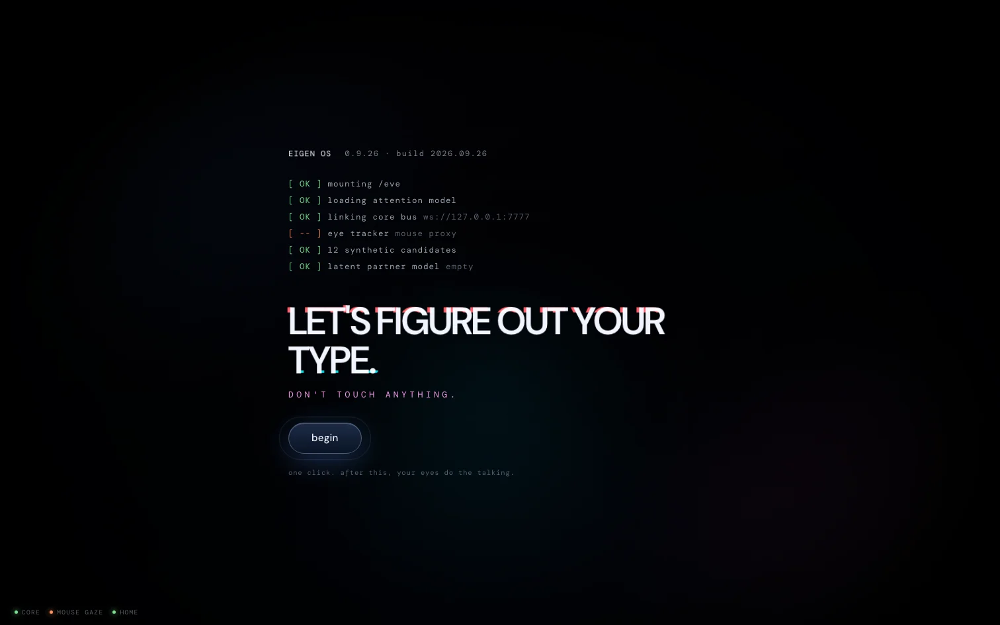 | 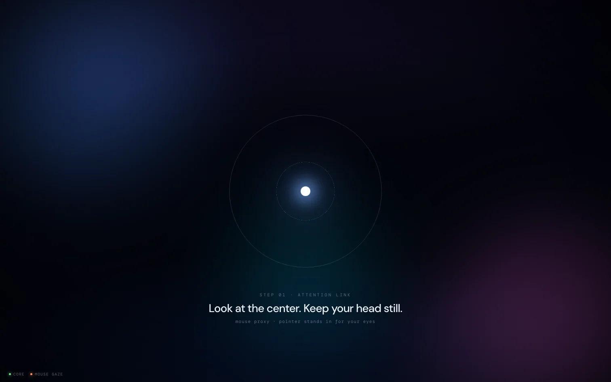 |
| 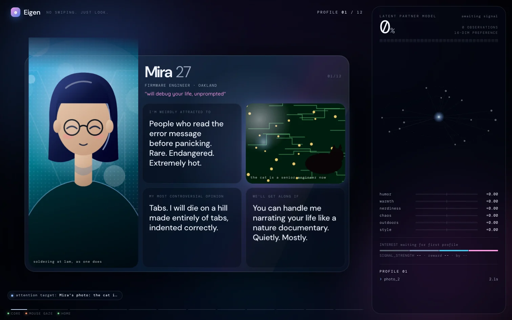 | 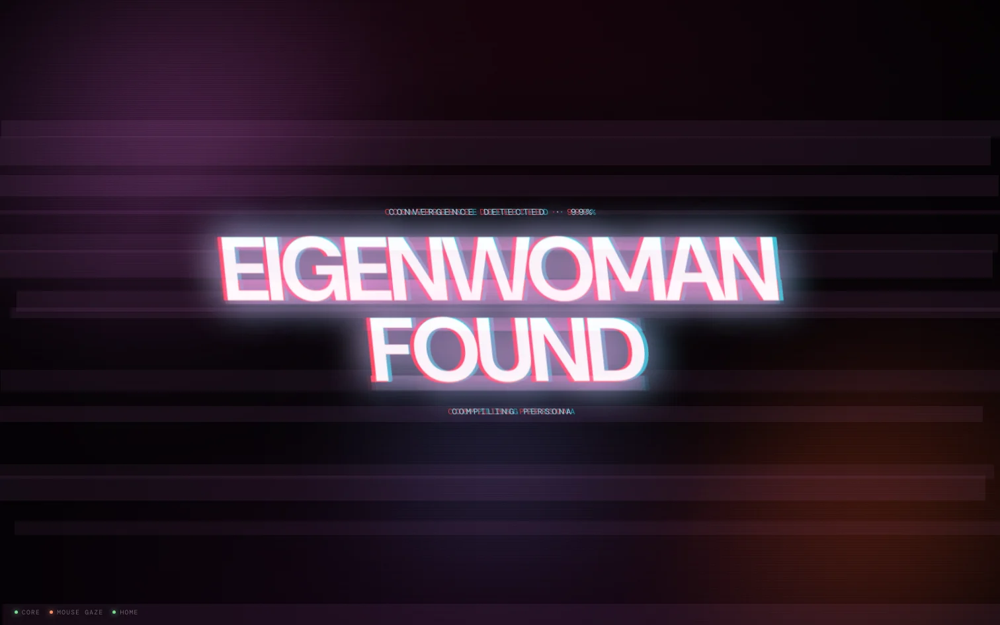 |
| 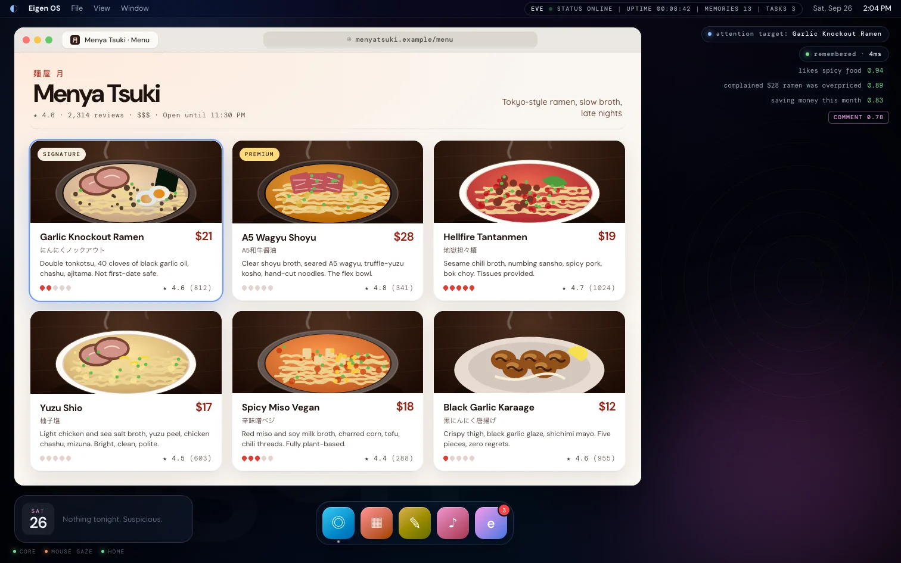 | 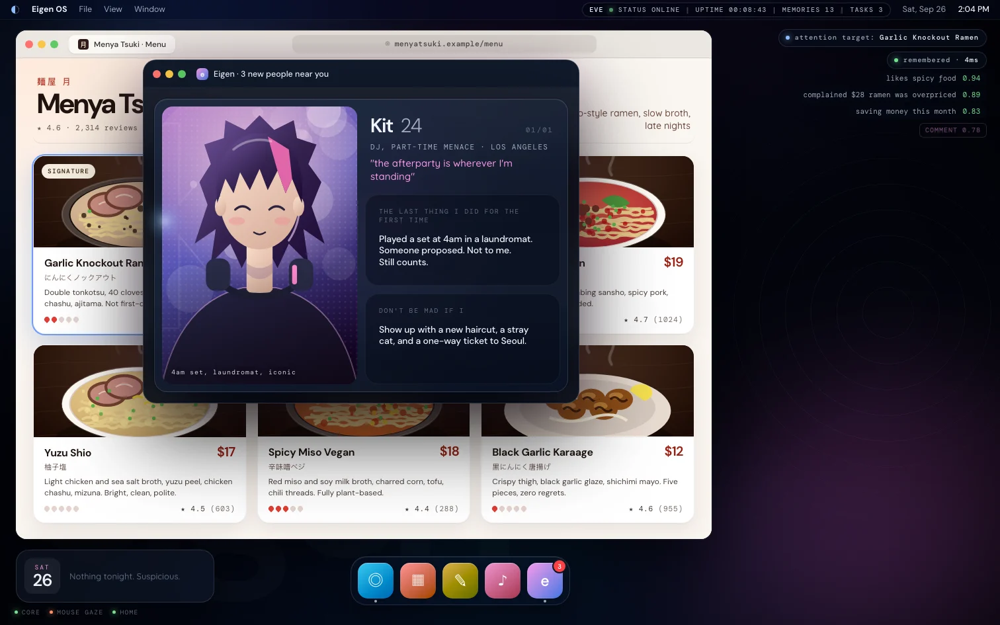 |
| 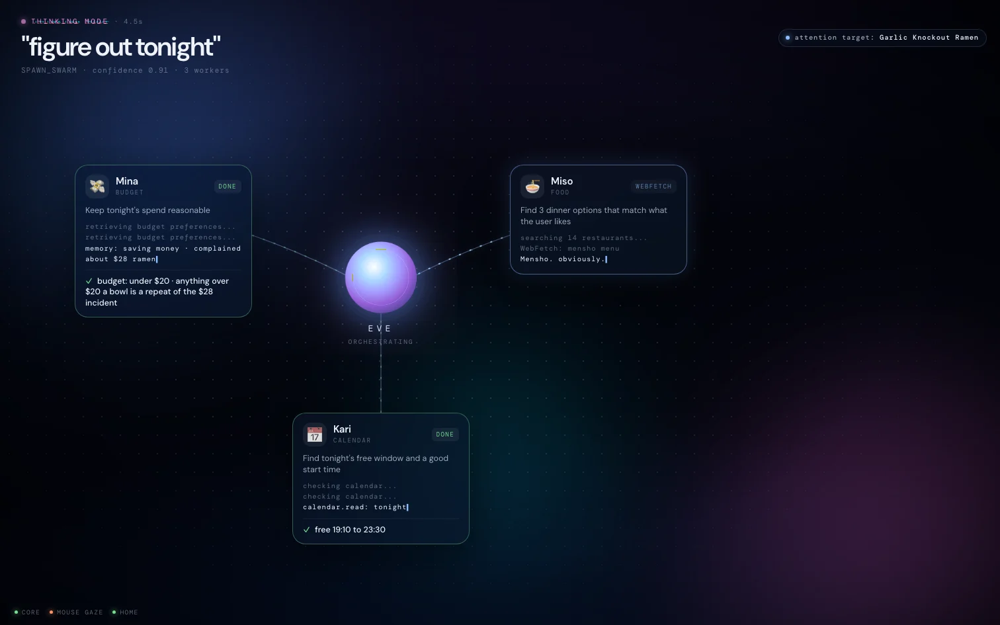 | 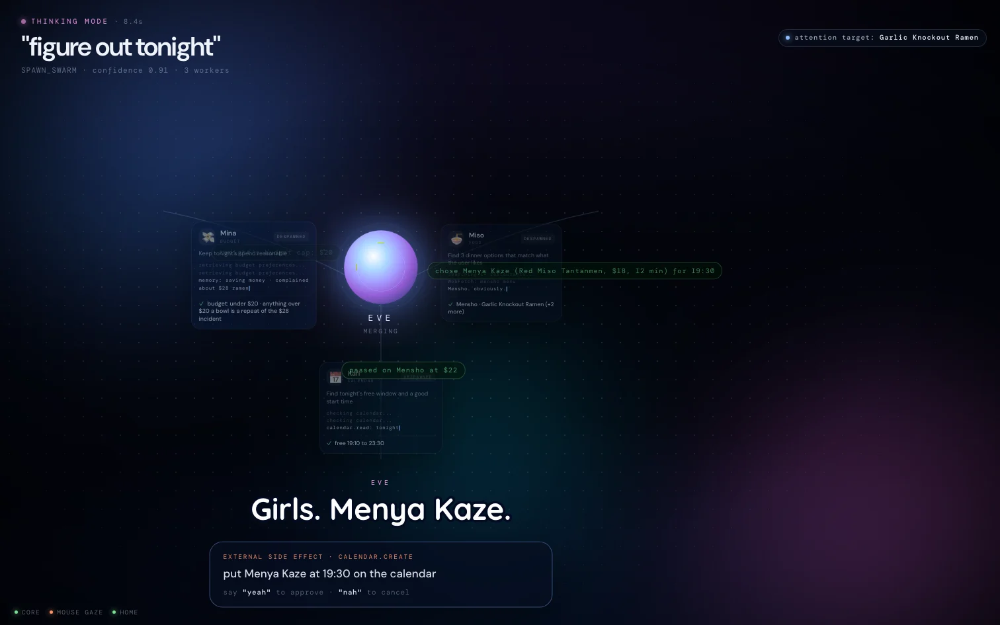 |
| 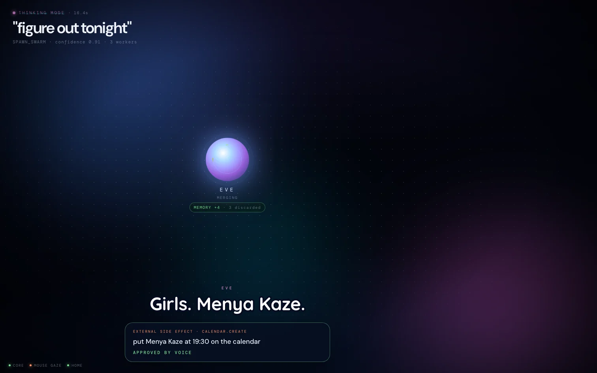 | 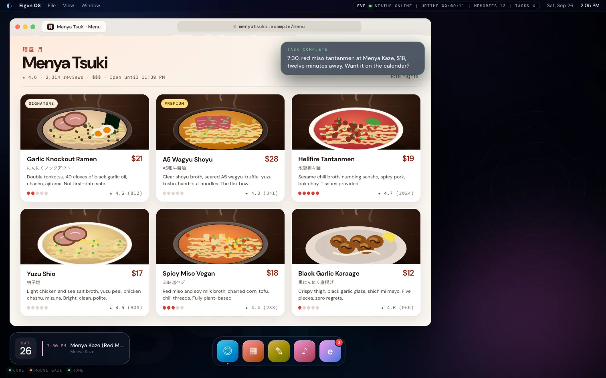 |
| 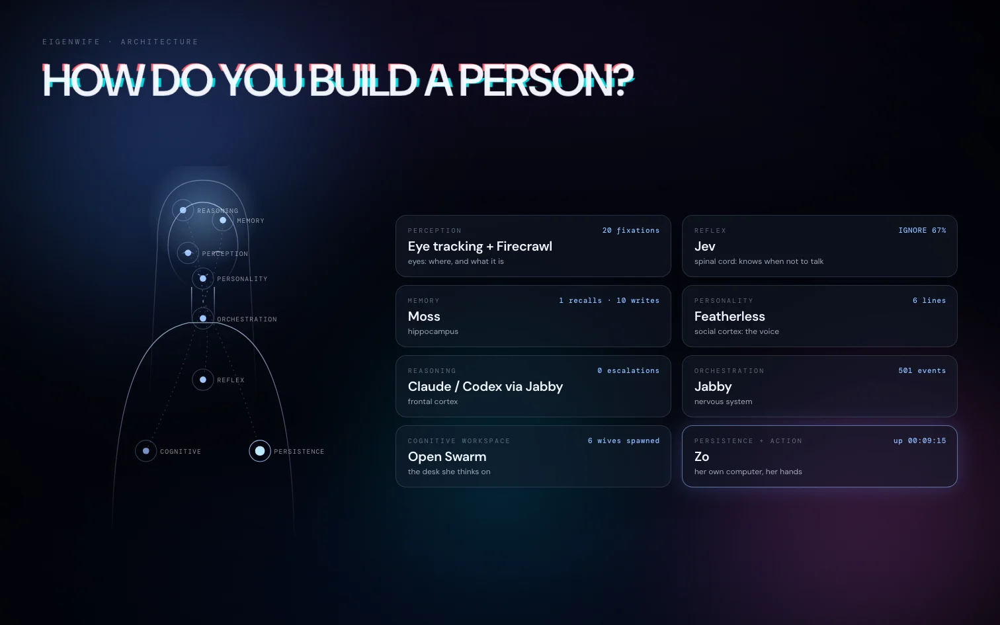 | 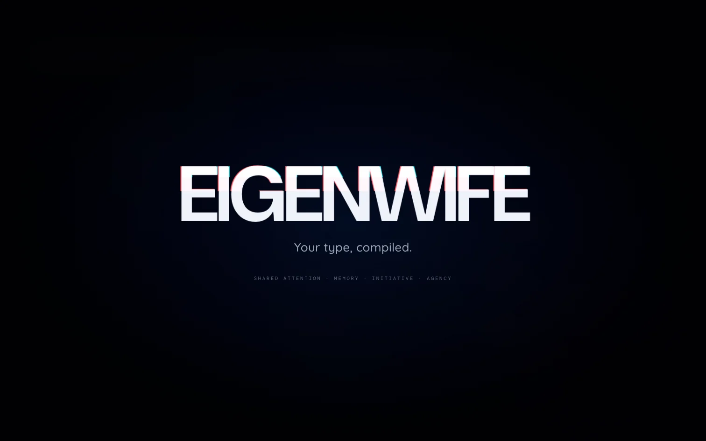 |
